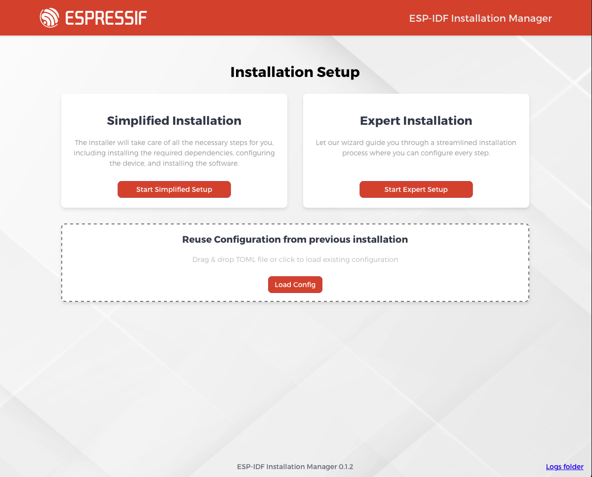

# Configuration

The ESP-IDF Installation Manager supports configuration through both its graphical interface and command line options. Choose the method that best suits your needs:

- [GUI Configuration](./gui_configuration.md): Configure through the graphical interface
- [CLI Configuration](./cli_configuration.md): Configure using command line arguments or configuration files

Both methods allow you to:
- Select ESP-IDF versions
- Choose installation paths
- Configure download mirrors
- Select target platforms
- Save configurations for future use

### Handling Existing ESP-IDF Repositories
If you specify an installation path that already contains a valid ESP-IDF Git repository, EIM will detect and use this existing repository. In this scenario, any ESP-IDF version selections made in the configuration file, command line, or GUI will be disregarded. EIM will proceed to install the necessary tools based on the version of ESP-IDF found in the existing repository, without overwriting its contents. This allows you to manage your ESP-IDF Git clone independently and use EIM solely for toolchain setup.

## Configuration Priority

The configuration priority order is:
1. Command line arguments (highest)
2. Environment variables
3. Configuration files
4. Default values (lowest)

## Using Configuration Files

Configuration files can be used with both the GUI and CLI versions of the installer:

### GUI Usage
In the GUI, you can provide a configuration file, just use the "Load Configuration" button in the initial screen or drag&drop the file onto the installer



### CLI Usage
With the CLI, you can specify a configuration file using the `--config` argument:
```bash
eim --config path/to/config.toml
```

## Configuration File Format

The installer uses TOML format for configuration files. Here is an example:

```toml
path = "/Users/Username/.espressif"
esp_idf_json_path = "/Users/Username/.espressif/tools"
tool_download_folder_name = "dist"
tool_install_folder_name = "tools"
target = ["all"]
idf_versions = ["v5.3.2"]
tools_json_file = "tools/tools.json"
idf_tools_path = "tools/idf_tools.py"
config_file_save_path = "/Users/Username/Downloads/config.toml"
non_interactive = false
wizard_all_questions = false
mirror = "https://github.com"
idf_mirror = "https://github.com"
recurse_submodules = false
install_all_prerequisites = false
```

After completing installation through either the GUI wizard or CLI, you have the option to save your configuration for future use. This saved configuration can be shared with other users to replicate the same installation setup.
