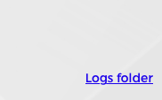
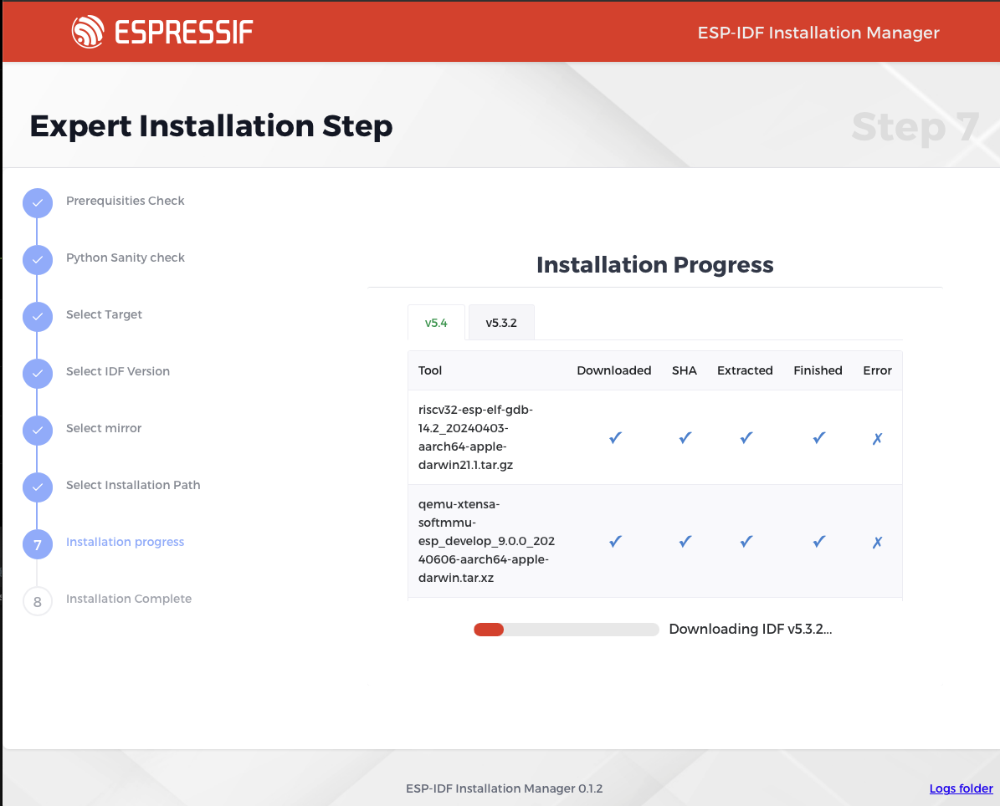
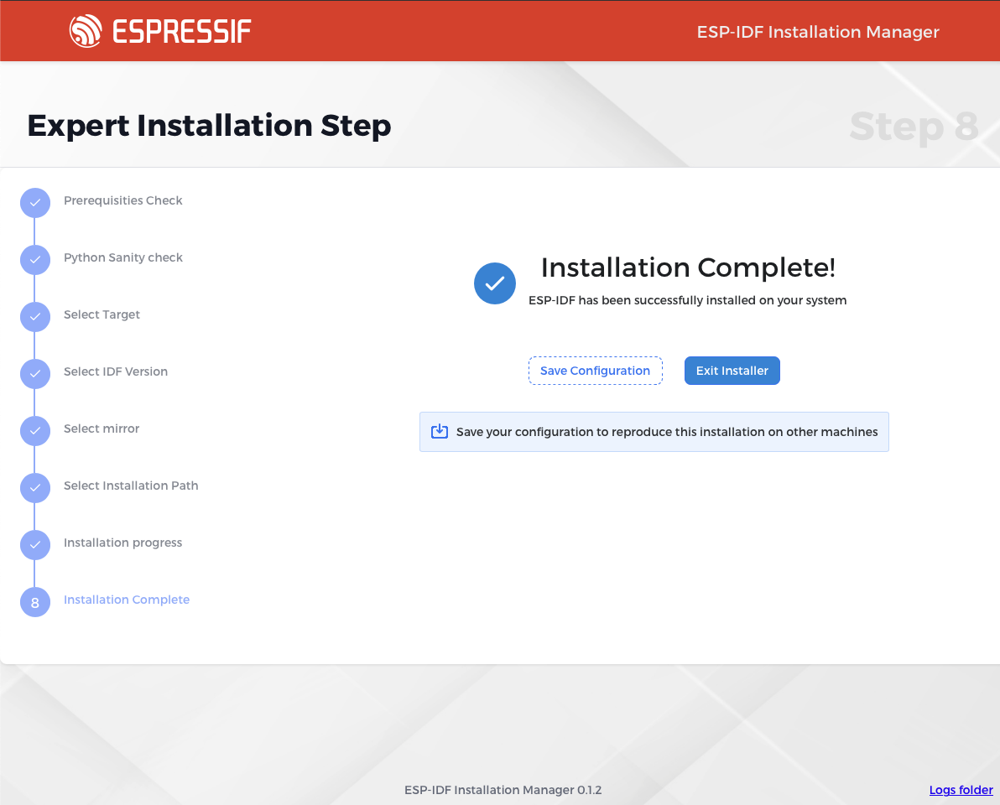

# Expert Installation

Expert installation is a wizard which will guide you through the installation process step by step and enable the user to tweak installation settings as needed. If the process hits a wall and you need more information for further troubleshooting, there is a button in the bottom right corner of the installation window. Clicking on the "Logs folder" button will open a window with the installation log files. This button is available on any screen of the installation process.

## Prerequisities check

The installer will first verify that all prerequisites are met. If any prerequisites are not satisfied, the installer will either prompt you to address them manually (on POSIX systems) or offer an option for automatic installation (only on Windows).

## Python Sanity Check

The installer will check if Python is installed and if it is the correct version and if it supports ssl and venv. If not, it will offer to install Python automatically (on windows) or prompt you to install it manually.

## Target selection

Next step involves selecting the Espressif chips you wish to develop for. This is a multi-select question, with the default option set to `all`. You can deselect this option and choose specific chips as needed. Once your selection is complete, proceed by pressing the continue button.

## IDF version selections

In the second step, you can choose from a list of supported ESP-IDF versions. While multiple versions can be selected, it is recommended to use the latest supported version, which is selected by default.

## Mirrors selections

You will then be prompted to select a mirror from which the ESP-IDF should be downloaded and also to select a mirror for downloading the necessary tools. For users in mainland China, it is advisable to avoid selecting GitHub. For users outside of China, it is recommended to select the default mirror.

## Installation path selections

In the next step, you will be prompted to enter the installation path for the ESP-IDF. The default path is `C:\esp` on Windows and `~\.espressif` on POSIX systems. It is recommended to use the folder browser for selecting the path.

**Important:** If you select a path that already contains an existing ESP-IDF Git repository, the installer will **use that repository directly** and will not rewrite its contents. In such cases, your previously selected preferred ESP-IDF version will be irrelevant, as the installer will work with the version present in the existing repository.

## Installation Progress

In the next step you can start the actual installation and then watch its progress. The table of components will inform you about the progress of the installation.

## Finish

Once the installation is complete, you will have the possibility to save the configuration for future use. This is only useful if you want to replicate the same installation on other machines. Otherwise, you can simply close the installer.

