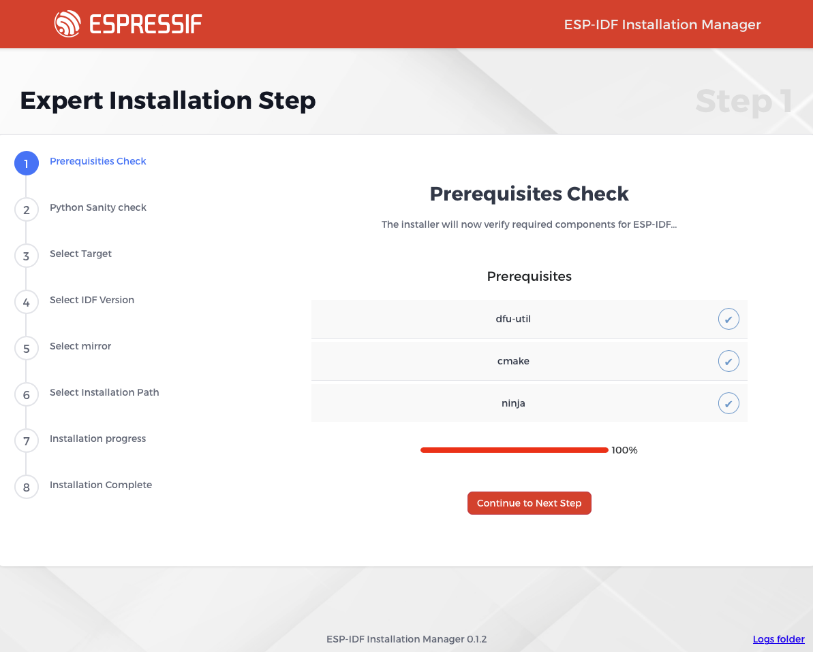
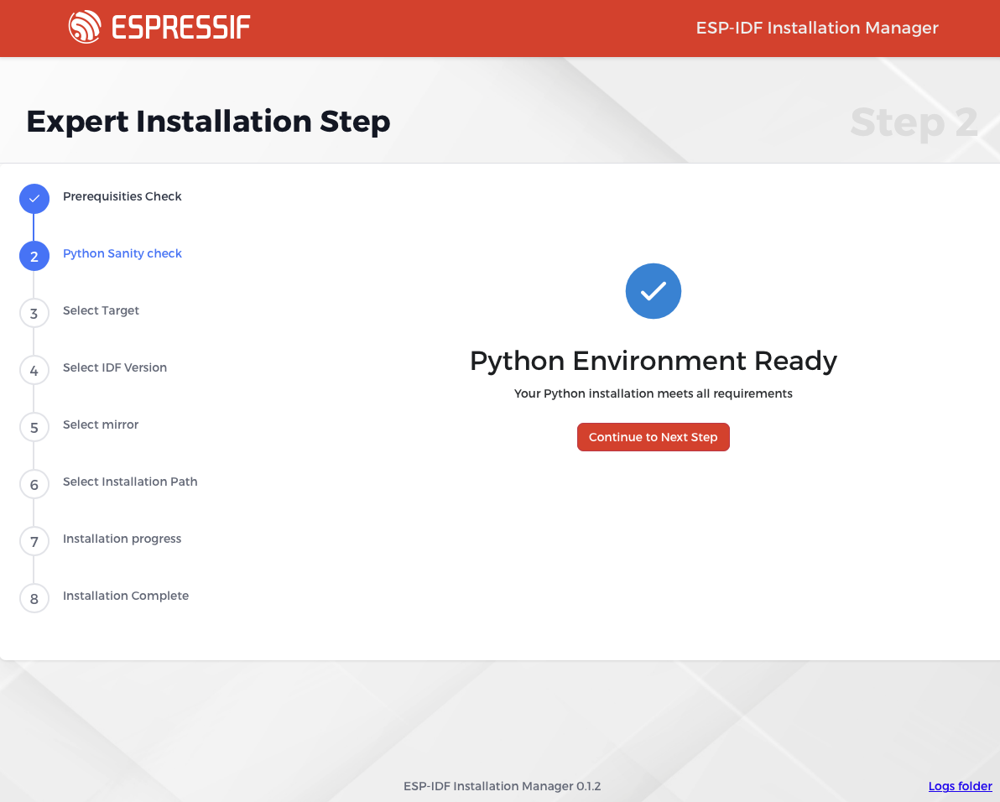
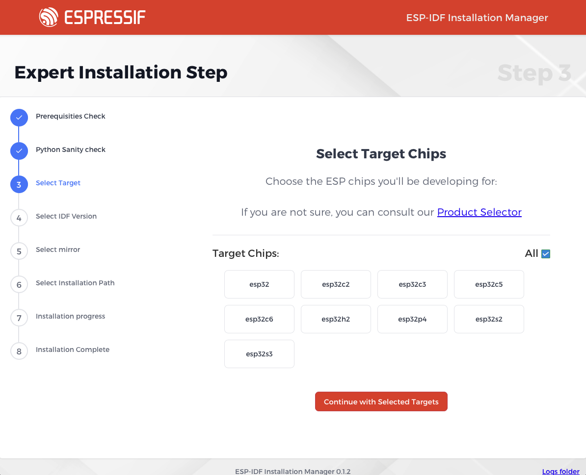
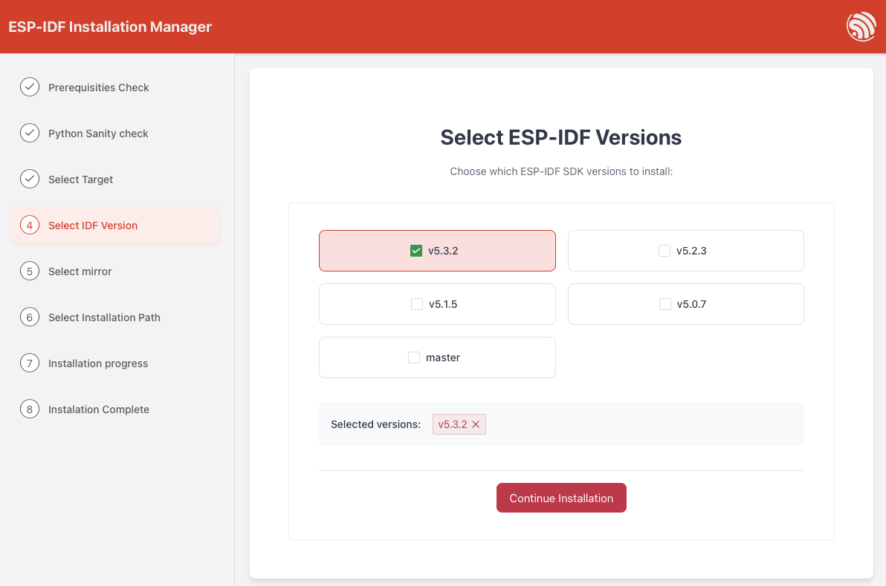
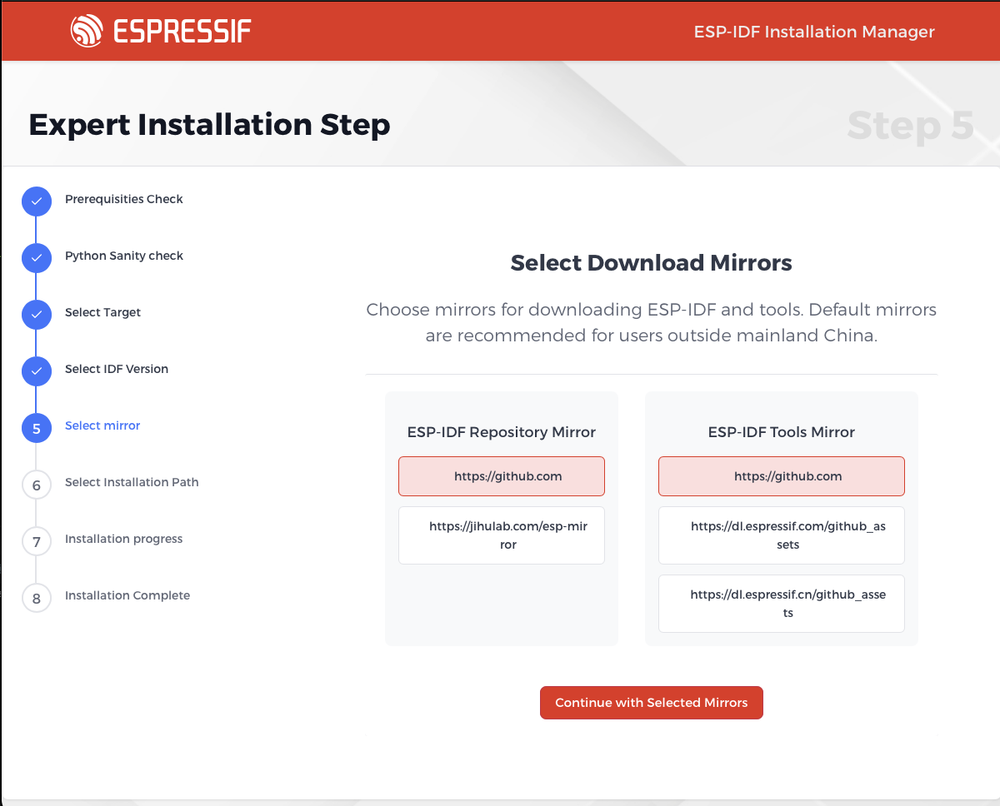
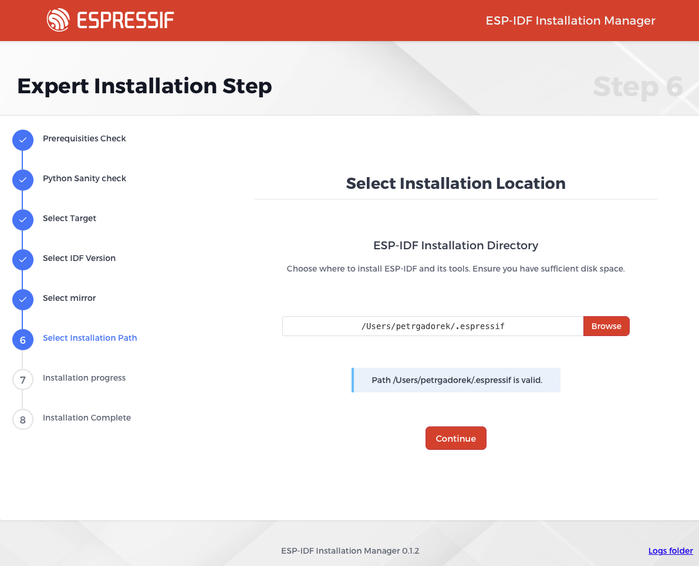

# Expert Installation

Expert installation is wizard which will guide you through the installation process step by step and enable the user to tweek installation settings as needed. First step is checking if all neede prerequsities are met.

## Prerequisities check

The installer will first verify that all prerequisites are met. If any prerequisites are not satisfied, the installer will either prompt you to address them manually (on POSIX systems) or offer an option for automatic installation.

## Python Sanity Check

The installer will check if Python is installed and if it is the correct version. If it supports ssl and venv. If not, it will offer to install Python automatically (on windows) or prompt you to install it manually.

## Target selection

Next step involves selecting the Espressif chips you wish to develop for. This is a multi-select question, with the default option set to `all`. You can deselect this option and choose specific chips as needed. Once your selection is complete, proceed by pressing the continue button.

## IDF version selections

In the second step, you can choose from a list of supported ESP-IDF versions. While multiple versions can be selected, it is recommended to use the latest supported version, which is selected by default.

## Mirrors selections

You will then be prompted to select a mirror from which the ESP-IDF should be downloaded adn also to select a mirror for downloading the necessary tools. For users in mainland China, it is advisable to avoid selecting GitHub. For users outside of China, it is recommended to select the default mirror.

## Installation path selections

In the next step, you will be prompted to enter the installation path for the ESP-IDF. The default path is `C:\esp` on Windows and `~\.espressif` on POSIX systems. It is recommended to use the folder browser for selecting the path.

## Installation Progress

in the next step you can start the actuall installation and than watch it's progress.
