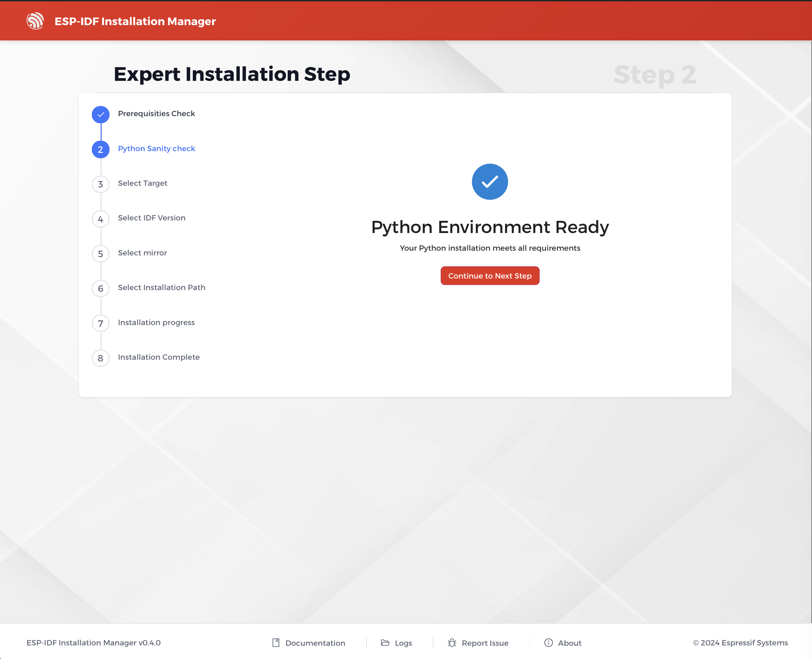
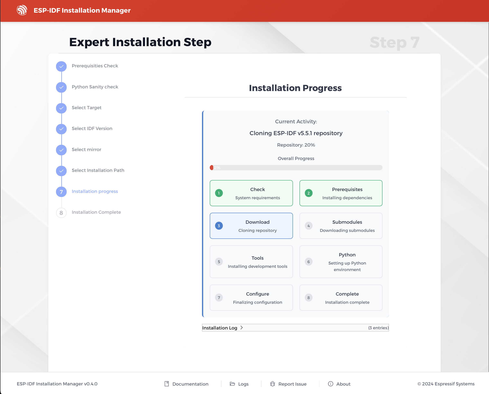
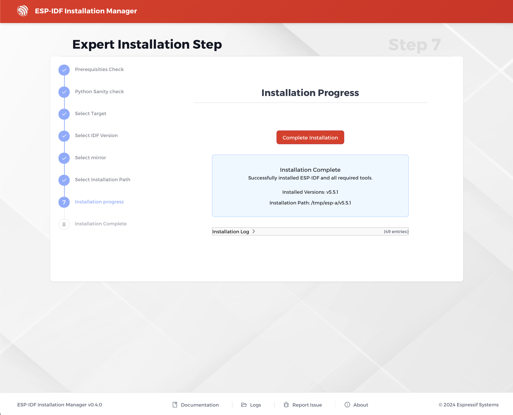
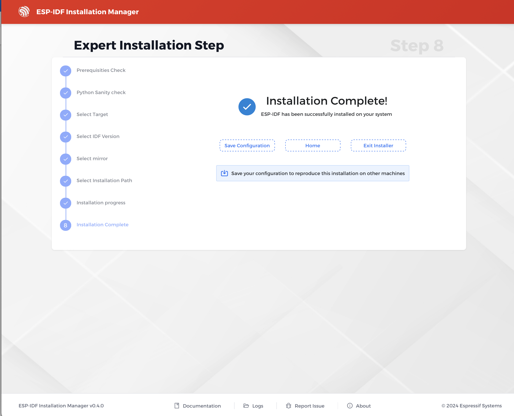

# Expert Installation

Expert installation is a wizard that guides you through the installation process step by step, enabling you to customize installation settings as needed.

## Prerequisites Check

The installer will first verify that all prerequisites are met.

## Installation Progress

After configuring the installation options, you can start the process. The new installation progress view provides a clear, detailed overview of the current activity and overall progress. The installation process is broken down into a series of steps:

1.  **Check**: System requirements are checked.
2.  **Prerequisites**: Dependencies are installed.
3.  **Download**: The ESP-IDF repository is cloned.
4.  **Submodules**: Submodules are downloaded.
5.  **Tools**: Development tools are installed.
6.  **Python**: The Python environment is set up. ESP-IDF supports Python versions 3.10, 3.11, 3.12, and 3.13. Python 3.14 and later are not supported.
7.  **Configure**: Final configuration is completed.
8.  **Complete**: The installation is finished.

A progress bar and a detailed installation log provide real-time updates for each step.

## Installation Complete

Once the installation is successful, a confirmation screen will appear, stating that ESP-IDF and all required tools have been successfully installed. It also shows the installed version and the installation path. From this screen, you can click **Complete Installation**.

