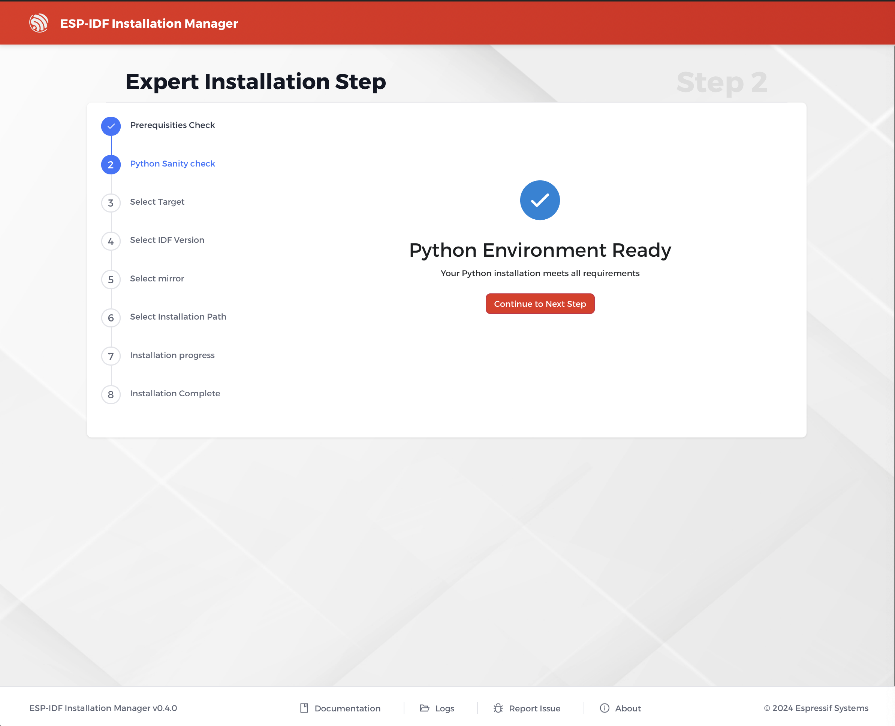
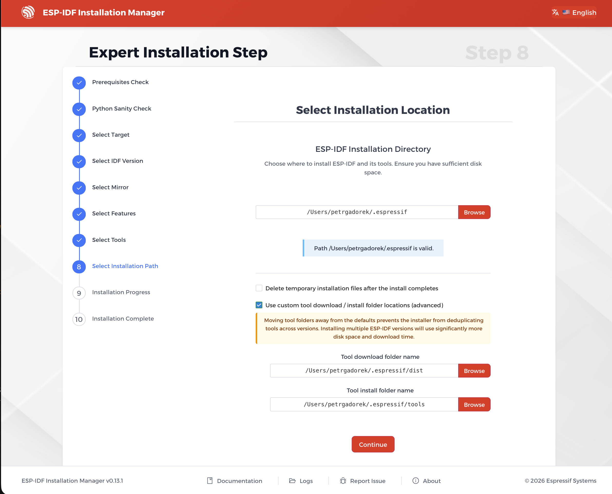
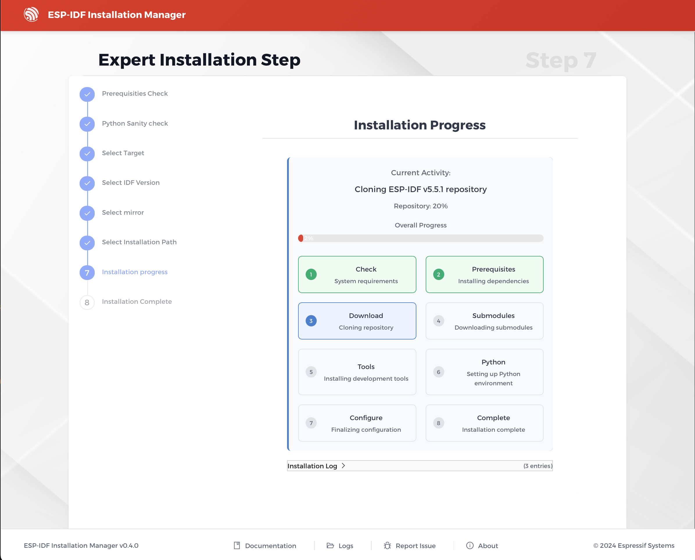
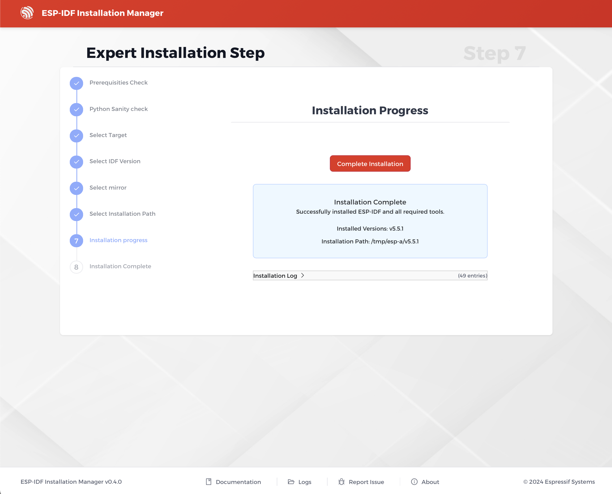
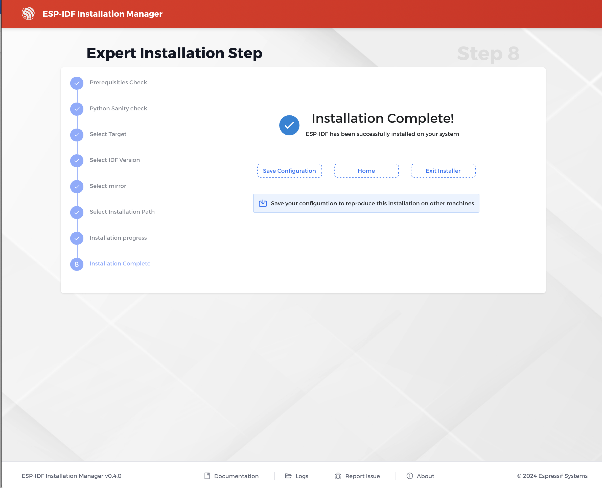

# Expert Installation

Expert installation is a wizard that guides you through the installation process step by step, enabling you to customize installation settings as needed.

## Prerequisites Check

The installer will first verify that all prerequisites are met.

## Select Installation Path

The **Select Installation Path** step lets you choose the base directory where ESP-IDF and its tools will be installed. The default is `C:\esp` on Windows and `~/.espressif` on POSIX systems. Use the **Browse** button to pick a different location.

> **Important:** If you select a path that already contains an existing ESP-IDF Git repository, the installer will use that repository directly and will not rewrite its contents.

Below the main path field, the step also exposes two **advanced / optional** settings:

  * **Delete temporary installation files after the install completes** — When enabled, the downloaded tool archives are removed once the installation finishes. This is the same behavior as the CLI's `--cleanup` flag and is useful for CI, Docker, and other single-use environments. Reinstalling or adding more ESP-IDF versions later will re-download a large amount of data, so leave this off if you plan to add more versions.
  * **Use custom tool download / install folder locations (advanced)** — Off by default. When enabled, two extra fields appear so you can rename the **Tool download folder** (default `dist`) and the **Tool install folder** (default `tools`). Use **Browse** to pick a directory; only the final folder name is kept and the folder is created under the chosen installation path. The installer warns that moving the tool folders away from the defaults prevents it from deduplicating tools across ESP-IDF versions, which will significantly increase disk space and download time when multiple versions are installed.

## Installation Progress

After configuring the installation options, you can start the process. The new installation progress view provides a clear, detailed overview of the current activity and overall progress. The installation process is broken down into a series of steps:

1.  **Check**: System requirements are checked.
2.  **Prerequisites**: Dependencies are installed.
3.  **Download**: The ESP-IDF repository is cloned.
4.  **Submodules**: Submodules are downloaded.
5.  **Tools Selection**: Select which development tools to install for each ESP-IDF version. Required tools are pre-selected and cannot be deselected. Tools already present on your system will be reused.
6.  **Tools**: Development tools are installed.
7.  **Python**: The Python environment is set up. ESP-IDF supports Python versions 3.10, 3.11, 3.12, 3.13, and 3.14. Note that Python 3.14 is now fully supported on Linux, macOS, and Windows.
8.  **Configure**: Final configuration is completed.
9.  **Complete**: The installation is finished.

A progress bar and a detailed installation log provide real-time updates for each step.

## Installation Complete

Once the installation is successful, a confirmation screen will appear, stating that ESP-IDF and all required tools have been successfully installed. It also shows the installed version and the installation path. From this screen, you can click **Complete Installation**.

