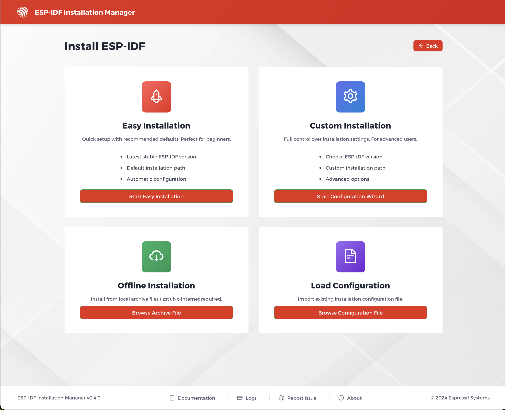

# GUI Configuration

The graphical interface of the ESP-IDF Installation Manager offers several ways to begin and configure an installation directly from the main welcome screen. You can choose a streamlined process, a detailed wizard, or use a pre-existing configuration file.

## Installation Options



From the initial screen, you have the following choices to begin a new installation:

  * **Simplified Installation**: A streamlined process with default settings, ideal for most users who want to quickly get started.
  * **Expert Installation**: A wizard that provides full control over the installation process, recommended for users who need specific configurations.
  * **Load Configuration**: A button that allows you to load a configuration file from your computer to automate the setup process.
  * **Offline Installation**: If an offline installer archive (`.zst` file) is detected in the same folder as the installer, this option becomes available to perform the installation without an internet connection.

## Privacy Settings

On the welcome screen, you will find a checkbox to control usage data tracking. By default, the installer collects anonymous data to help us improve the product. If you wish to disable this, simply uncheck the box. For more details on what data is collected, please see the [Privacy and Data Collection section in General Information](./general_info.md#privacy-and-data-collection).

## Simplified Installation

The simplified installation uses default settings optimized for most users. While it requires minimal configuration, you can still:

  * Load a configuration file by dragging and dropping it onto the installer's welcome screen.
  * Monitor installation progress through a progress bar and a detailed log window.
  * Save your configuration after installation for future use.

## Expert Installation

The expert installation is a wizard that guides you through the process step by step, allowing you to fine-tune the settings as needed. The wizard sections include:

### Target Selection

Choose which Espressif chips you want to develop for. The default "all" option can be deselected to choose specific targets.

### IDF Version

Select from a list of supported ESP-IDF versions. While multiple versions can be installed, it is recommended to use the latest supported version.

### Download Mirrors

Choose mirrors for downloading ESP-IDF and tools. For users in mainland China, non-GitHub mirrors are recommended.

### Installation Path

Specify where ESP-IDF should be installed. The default path is `C:\esp` on Windows and `~/.espressif` on POSIX systems.

> **Important:** If you select a path that already contains an existing ESP-IDF Git repository, the installer will use that repository directly and will not rewrite its contents.

## Configuration Files

The ESP-IDF Installation Manager supports using configuration files to specify installation settings. This is particularly useful for:

  * Replicating the same setup on different machines.
  * Sharing configurations with team members.
  * Automated deployments.

### Loading a Configuration File

You can load a configuration file in two ways:

  * **Using the GUI**: On the main installer screen, click the **Load Configuration** button to open a file explorer and select your `.toml` file.
  * **Using the CLI**: With the command line, you can specify a configuration file using the `--config` argument.

### Configuration File Format

The installer uses the TOML format for configuration files. Every line is optional; you only need to include the parameters you want to configure.

Here is an example of a comprehensive configuration file:

```toml
eim_config.toml
path = "/Users/testusername/.espressif"
idf_path = "/Users/testusername/.espressif/v5.5/esp-idf"
esp_idf_json_path = "/Users/testusername/.espressif/tools"
tool_download_folder_name = "/Users/testusername/.espressif/dist"
tool_install_folder_name = "/Users/testusername/.espressif/tools"
target = ["all"]
idf_versions = ["v5.5"]
tools_json_file = "tools/tools.json"
config_file_save_path = "eim_config.toml"
non_interactive = true
wizard_all_questions = false
mirror = "https://github.com"
idf_mirror = "https://github.com"
recurse_submodules = true
install_all_prerequisites = true
skip_prerequisites_check = false
```
