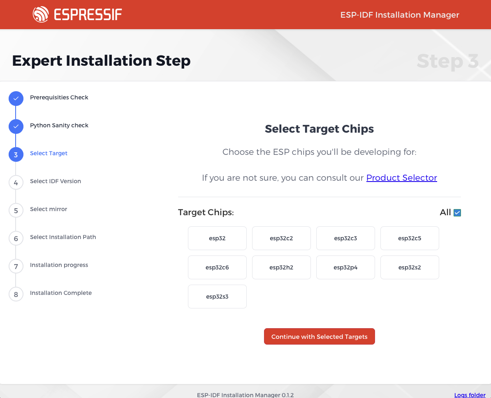

# GUI Configuration

The graphical interface of ESP-IDF Installation Manager offers two configuration approaches:

## Simplified Installation Configuration

The simplified installation uses default settings optimized for most users. While it requires minimal configuration, you can still:

- Load a configuration file by dragging and dropping it onto the installer
- Monitor installation progress through the progress bar and log window
- Save your configuration after installation for future use

## Expert Installation Configuration

The expert installation provides full control over the installation process through a wizard interface. You can configure:

### Target Selection
Choose which Espressif chips you want to develop for. The default "all" option can be deselected to choose specific targets.

### IDF Version
Select from supported ESP-IDF versions. While multiple versions can be installed, it's recommended to use the latest supported version.

### Download Mirrors
Choose mirrors for downloading ESP-IDF and tools. For users in mainland China, non-GitHub mirrors are recommended.

### Installation Path
Specify where ESP-IDF should be installed. The default is `C:\esp` on Windows and `~/.espressif` on POSIX systems.

## Configuration Files

You can save your configuration choices for future use. This is particularly useful for:
- Replicating the same setup on different machines
- Sharing configurations with team members
- Automated deployments

The saved configuration file uses the TOML format and can be loaded in future installations via drag & drop or the load configuration button. 