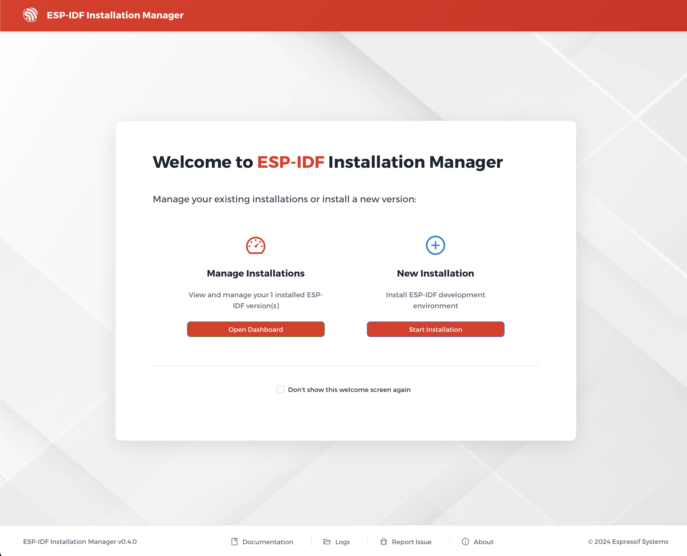

# Installation Methods

The ESP-IDF Installation Manager (EIM) offers multiple ways to install ESP-IDF based on your needs.

## Graphical User Interface (GUI)

The GUI installer provides two primary entry points from the welcome screen:

1.  **New Installation**: A wizard that guides you through the installation process. It offers both a streamlined **Simplified Installation** and a more customizable **Expert Installation**.
2.  **Offline Installation**: If an offline archive (`.zst` file) is detected, the installer will present this option to perform a full installation without an internet connection.

If you have an existing ESP-IDF installation, the welcome page will change to give you the option to **Manage Installations**, which takes you to the new **Version Management** dashboard.

## Command Line Interface (CLI)

The CLI version is ideal for:
- Automated installations
- CI/CD pipelines
- Docker environments
- Users who prefer command line tools

1.  **Interactive Mode**: Run without parameters for a step-by-step wizard.
2.  **Headless Mode**: Use command line arguments for automated installations.
