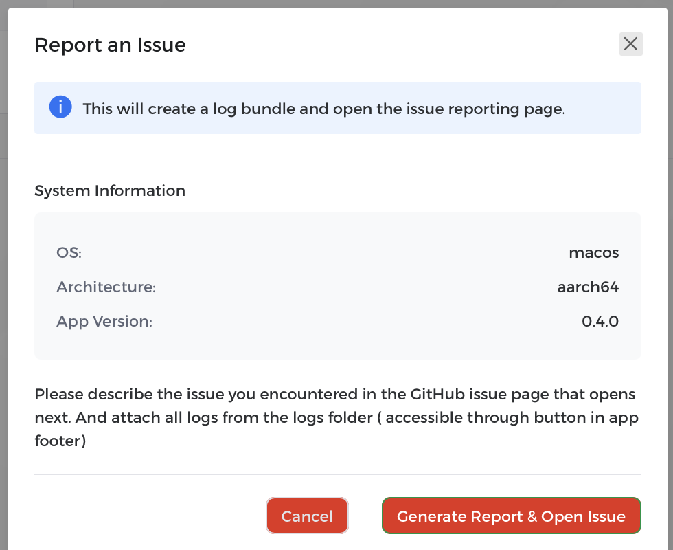

# Reporting an Issue

The installer now includes a **Report Issue** button in the footer of every screen. This feature simplifies the process of reporting bugs and problems you encounter.

Clicking the **Report Issue** button will open a modal window displaying your system information, including your OS, architecture, and the installer's app version. Clicking the **Generate Report & Open Issue** button will create a log bundle and automatically open a new issue page on GitHub, with the system information pre-filled.

> **Note**
> You will still need to manually attach the log files and describe the issue you encountered in the GitHub issue page before submitting. The log files can be accessed via the **Logs** button in the footer.

## Log File Locations

If you need to manually access the log files, they are stored in the following locations depending on your operating system:

| Platform | Log Directory |
|----------|---------------|
| Linux | `$XDG_DATA_HOME/eim/logs` or `$HOME/.local/share/eim/logs` |
| macOS | `$HOME/Library/Application Support/eim/logs` |
| Windows | `{FOLDERID_LocalAppData}\eim\logs` (typically `C:\Users\<username>\AppData\Local\eim\logs`) |
