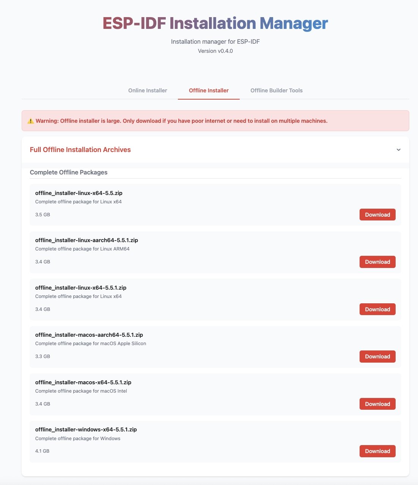
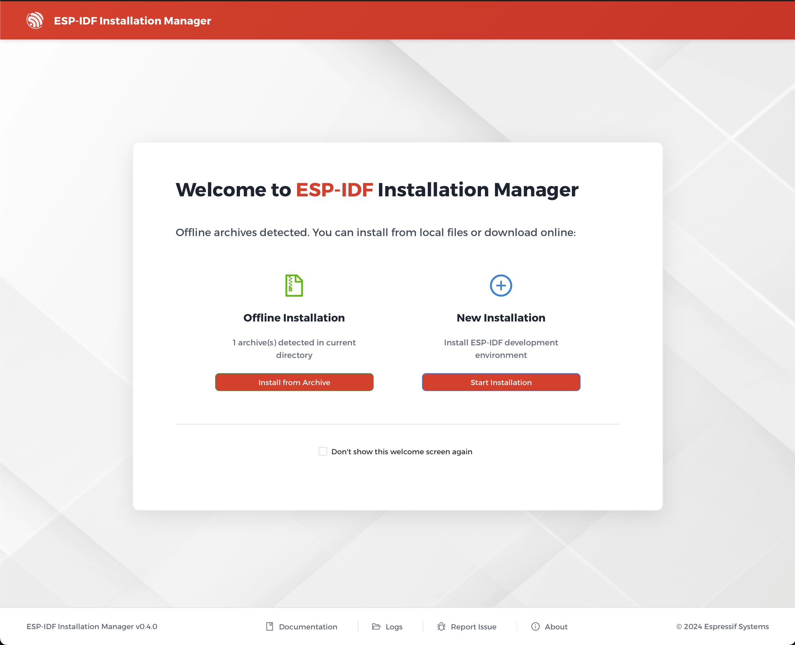
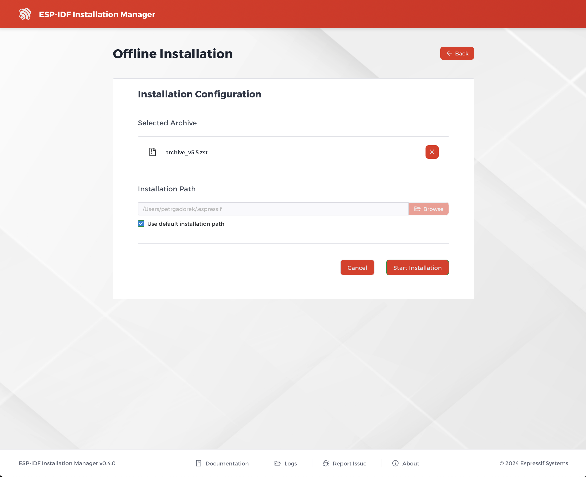
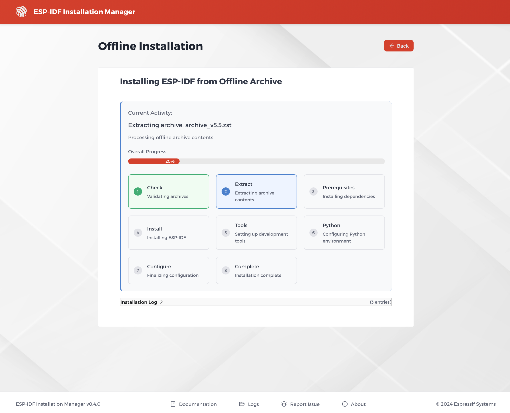

# Offline Installation

The offline installation feature allows you to install ESP-IDF without an active internet connection. This is particularly useful in environments with restricted network access or for creating reproducible builds. **This feature is now available through the GUI as well as the CLI.**

## How to Get the Offline Installer

To perform an offline installation, you first need to download the appropriate offline installer artifact for your operating system, platform, and desired ESP-IDF version. These artifacts are available from the the [Espressif Download Portal](https://dl.espressif.com/dl/eim/?tab=offline).



The downloaded artifact is a zip archive containing the installer binary and a `.zst` archive with all the necessary data.

### GUI-Based Offline Installation



1.  Unzip the downloaded artifact.
2.  Launch the installer application. The welcome screen will automatically detect the offline archive in the same directory and offer an **Offline Installation** option.
3.  Click **Install from Archive**.
4.  The next screen will show the detected archive and allow you to configure the **Installation Path**. You can use the default path or choose a custom one.
5.  Click **Start Installation** to begin. The installation progress will be displayed, mirroring the progress view of the expert installation.




### CLI-Based Offline Installation

1.  Unzip the downloaded artifact.
2.  Open your terminal or command prompt and navigate to the extracted folder.
3.  Run the installer using the `--use-local-archive` command-line option, providing the path to the `.zst` archive.

```bash
eim install --use-local-archive PATH_TO_ARCHIVE
```

> **Important**
> You **must not** unpack the `.zst` archive. The installer uses the compressed archive directly. Unpacking it will cause the installation to fail.

## Prerequisites

On Windows, the offline installer will automatically install the necessary prerequisites (Git and Python) if they are not found. On macOS and Linux, you must have the required prerequisites installed on your system before running the offline installer.

> **Important Note on Python Version**
> The offline installation currently **only supports Python 3.11 to 3.13**. Please ensure you have a compatible Python version installed and available in your system's PATH before starting the installation.

## Creating Your Own Offline Archive

If you need to create a custom offline installer with specific ESP-IDF versions or configurations, you can use the **Offline Archive Builder** tool. For more information, see the [Offline Archive Builder](./offline_archive_builder.md) documentation.
