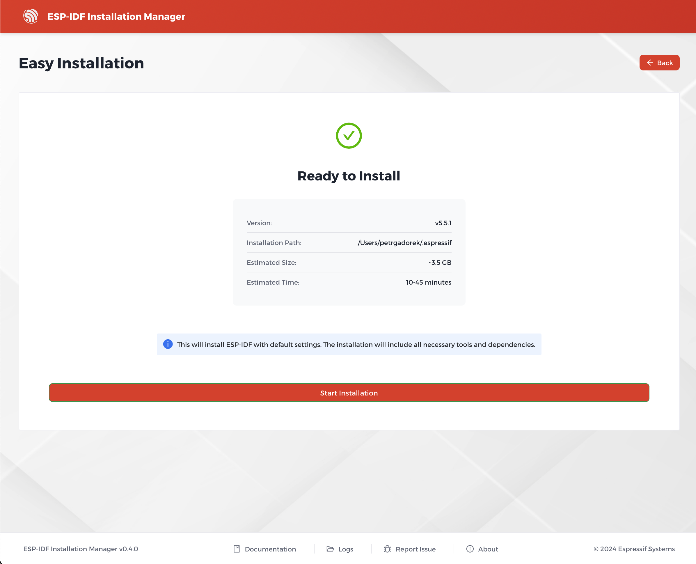

# Easy Installation

The easy installation is a streamlined process with default settings, ideal for most users who want to quickly get started with ESP-IDF development. You can choose this option from the main installation screen, which also offers expert installation, loading a configuration file, or offline installation.

> **Note:** The easy installation automatically includes the **ESP-IDF IDE feature**, which is required for integration with supported IDEs (such as Visual Studio Code and Espressif IDE).
>
> If you switch to **Expert mode**, the ESP-IDF IDE feature is **not selected automatically** and must be manually enabled to ensure IDE integration.

Once you select simplified installation, the process will check prerequisites and path availability, then wait for user confirmation.

Once confirmed, the process will begin automatically. You can monitor its progress through a progress bar and see real-time updates in a log window. To view a more detailed log, you can open the installation log window by clicking the "Installation log" button. This frame is scrollable and can be closed by clicking the button again.

The installation will finish with a success message, indicating that the ESP-IDF environment—including IDE integration support—is ready to use.

In case of any issues during the installation, the installer will display a failure message. You can consult the installation log for more information on the cause of the failure. You have several options to proceed:
* **Try again**: Re-run the installation after manually resolving the issue.
* **Expert mode**: Switch to the expert installation wizard for more control over the process. When using expert mode, ensure that the **ESP-IDF IDE feature** is selected if IDE integration is required.

For additional troubleshooting and information about the installation process, you can click the "Logs folder" button, which is available on any screen. This button will open the directory containing the installation log files.
