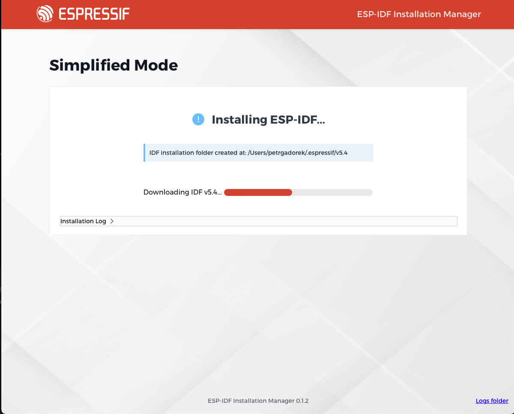
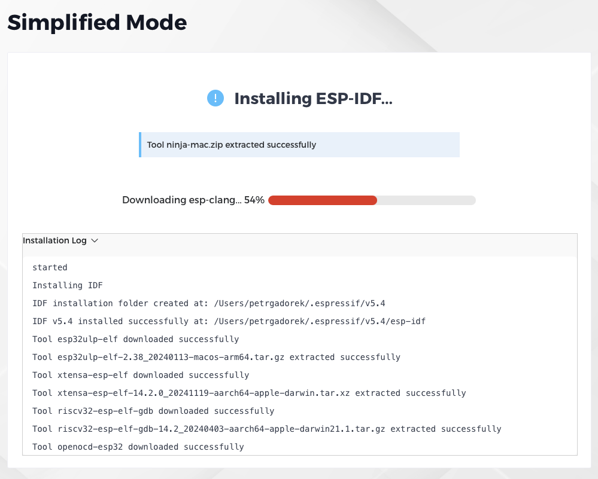
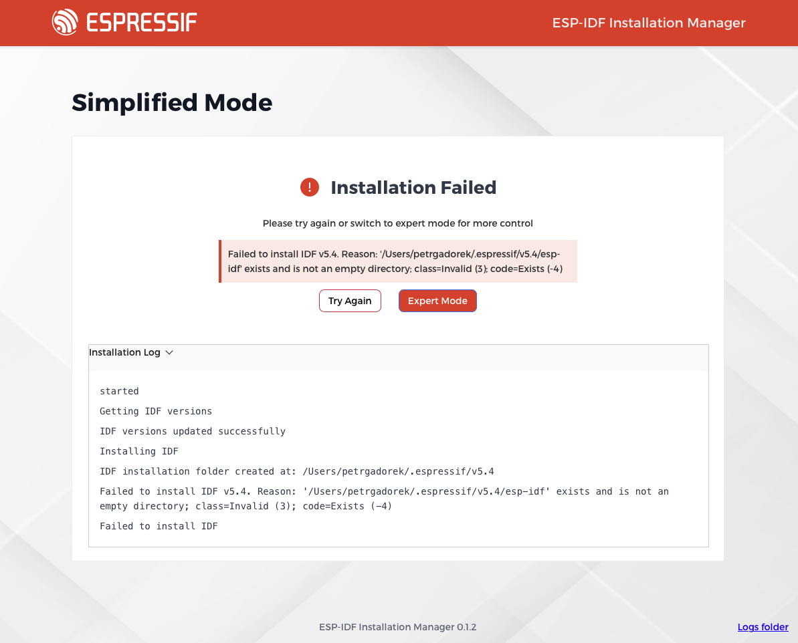

# Simplified Installation

After selecting the simplied installation option, the instalation will start automatically. The installation process will download and install the necessary components for the ESP-IDF.

The use can watch progress of the installation on progress bar with regular messages popping out in the corner, informing user about cuttently installed components.

For more detailed information about the installation process, user can open the installation log window by clicking on the "Installation log" button. The frame with the logs is scrollable and can be closed by clicking again on the button.

The installation will finish with a success message and the ESP-IDF environment will be ready to use.

In case of any issues during the installation process, user can consult the installation log for more information. Where the reason of failure can be found.

In that case user can try to re-run the installation process clicking on the "Try again" button (usually after he resolves the issue manualy) or try to switch to the advanced installation option by clicking on the "Expert mode" button.

For troubleshhoting and more information about the installation process, there is added button in the bottom right corner of the installation window. Clicking on the "Logs folder" button will open the window with the installation log files. This button is avalible on any screen of the installation process.

