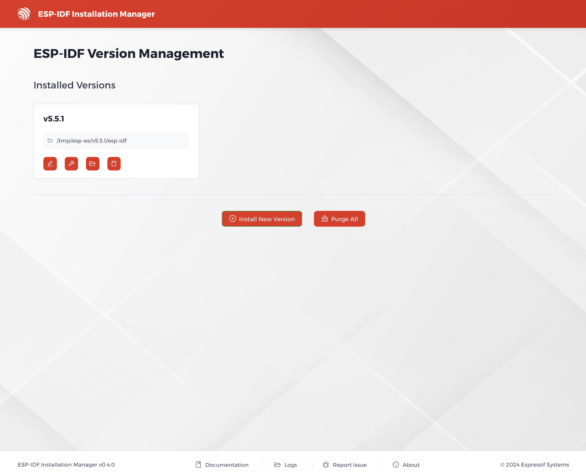

# Version Management

The Version Management dashboard is a new GUI feature that gives you full control over your installed ESP-IDF environments. You can access it from the welcome page by clicking **Open Dashboard** when an installation is already present.

On this page, you can see a list of all your installed ESP-IDF versions. For each version, you can:

  * **Rename**: Change the name of the installed version.
  * **Fix/Reinstall**: Rerun the installation process to repair a corrupted environment.
  * **Open Folder**: Open the installation directory in your file explorer.
  * **Delete**: Uninstall the specific ESP-IDF version.

At the bottom of the page, you'll also find options to:

  * **Install New Version**: Launch a new installation wizard.
  * **Purge All**: Delete all installed ESP-IDF versions.

