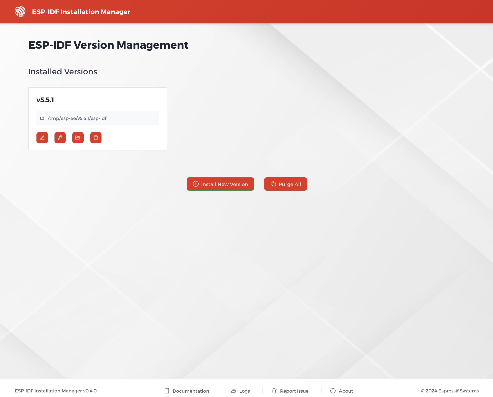
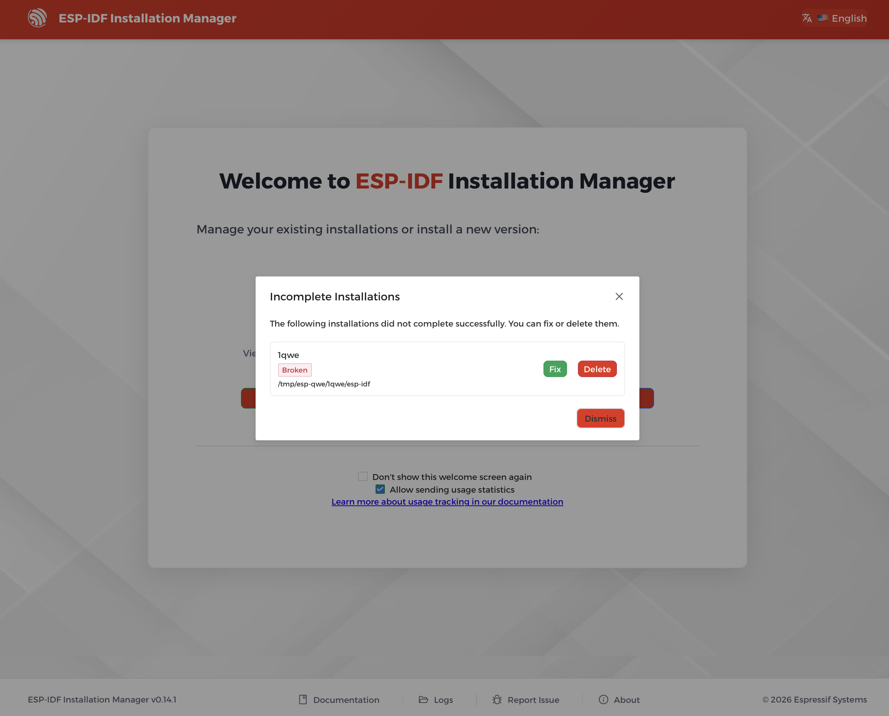

# Version Management

The Version Management dashboard gives you full control over your installed ESP-IDF environments. You can access it from the welcome page by clicking **Open Dashboard** when an installation is already present.

## Installed Versions

Each installed version is shown as a card. Alongside the version name you will see a **status tag** when the installation is not in a healthy state:

| Status | Tag colour | Meaning |
|---|---|---|
| *(none shown)* | — | Installation completed successfully |
| **In Progress** | orange | Installation was interrupted or is still running |
| **Failed** | red | Installation failed before finishing |
| **Being Repaired** | orange | A repair is currently in progress |
| **Broken** | red | A repair attempt failed |

For each version card you can:

* **Open IDF Terminal**: Open a terminal with the appropriate IDF environment activated.
* **Rename**: Change the display name of the installed version.
* **Fix/Reinstall**: Rerun the installation process to repair a corrupted environment. You will be redirected to the installation progress page where you can follow the repair live.
* **Open Folder**: Open the installation directory in your file explorer.
* **List Tools**: Inspect the toolchain tools and their on-disk installation status.
* **Export Config**: Save the installation configuration to a `.toml` file (only shown when a configuration is available).
* **Delete**: Uninstall the specific ESP-IDF version.

At the bottom of the page you will also find options to:

* **Install New Version**: Launch a new installation wizard.
* **Purge All**: Delete all installed ESP-IDF versions.

## Incomplete Installation Detection

When EIM starts, it automatically checks whether any previously started installations did not finish successfully (status is anything other than *Finished*). If such installations are found, a modal dialog appears immediately:

For each incomplete installation the modal shows its name, status tag, and path. You can:

* **Fix** — start a repair and be taken directly to the installation progress page to follow the process live.
* **Delete** — remove the incomplete installation entirely.
* **Dismiss** — close the modal and deal with the entries later from the Version Management dashboard.

This check runs only once per app start and is non-blocking — the rest of the application is fully usable while the modal is open.
