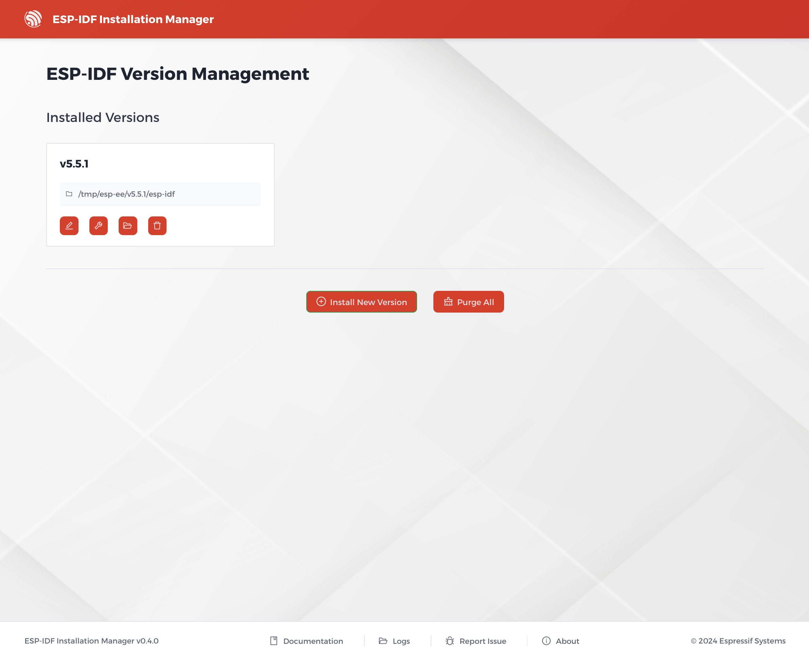
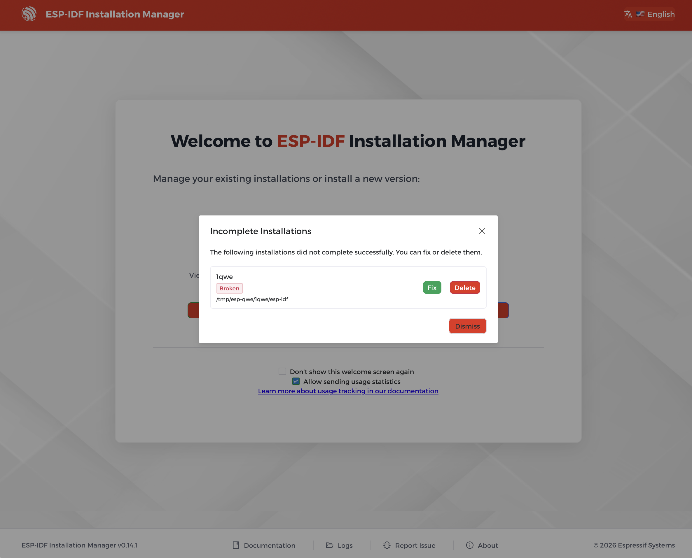

# Version Management

The Version Management dashboard gives you full control over your installed ESP-IDF environments. You can access it from the welcome page by clicking **Open Dashboard** when an installation is already present.

## Installed Versions

Each installed version is shown as a card. Alongside the version name you will see a **status tag** when the installation is not in a healthy state:

| Status | Tag colour | Meaning |
|---|---|---|
| *(none shown)* | — | Installation completed successfully |
| **In Progress** | orange | Installation was interrupted or is still running |
| **Failed** | red | Installation failed before finishing |
| **Being Repaired** | orange | A repair is currently in progress |
| **Broken** | red | A repair attempt failed |

For each version card you can:

* **Open IDF Terminal**: Open terminal with the appropriate IDF activated.
* **Rename**: Change the display name of the installed version.
* **Fix/Reinstall**: Rerun the installation process to repair a corrupted environment. This preserves the target, features and tools the version was originally installed with, so you don't lose any customization. You will be redirected to the installation progress page where you can follow the repair live.
* **Open Folder**: Open the installation directory in your file explorer.
* **List Tools**: Open a modal showing every tool declared in the version's `tools.json`, its installed version(s), and whether it's up to date. See **Adding More Tools** below.
* **List Features**: Open a modal showing every optional Python feature declared in the version's `requirements.json` (e.g. `ci`, `docs`, `pytest`, `gdbgui`, `ide`) and whether each one is currently installed. See **Adding More Features** below.
* **Export Config**: Save the installation configuration to a `.toml` file (only shown when a configuration is available).
* **Delete**: Uninstall the specific ESP-IDF version.

### Adding More Tools to an Existing Installation

Open **List Tools** for a version to see its full tool catalog, including optional tools that weren't installed. If any optional tools are available to add, an **Add more tools** button appears next to the IDF/tools paths at the top of the modal. Click it, check the tools you want, and confirm — this triggers a repair (the same mechanism as **Fix**) that reinstalls the version with the newly selected tools added on top of what's already there, without touching your existing configuration otherwise.

### Adding More Features to an Existing Installation

Open **List Features** for a version the same way. The required `core` feature is always shown as installed; any optional feature (e.g. `docs`, `pytest`) that isn't yet part of the version's configuration appears as a candidate under **Add more features**. Click it, check the features you want, and confirm — like **Add more tools**, this triggers a repair that reinstalls the version with the newly selected features added on top of what's already installed.

## Incomplete Installation Detection

When EIM starts, it automatically checks whether any previously started installations did not finish successfully (status is anything other than *Finished*). If such installations are found, a modal dialog appears immediately:

For each incomplete installation the modal shows its name, status tag, and path. You can:

* **Fix** — start a repair and be taken directly to the installation progress page to follow the process live.
* **Delete** — remove the incomplete installation entirely.
* **Dismiss** — close the modal and deal with the entries later from the Version Management dashboard.

This check runs only once per app start and is non-blocking — the rest of the application is fully usable while the modal is open.
